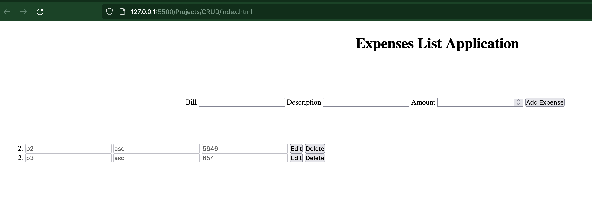

# Expenses Application

## Version 1.0.0

This is a simple application that use pure javascript to creates a CRUD using localstorage and events created in javascript that allows to add a expense, edit or remove and expense

### Bugs

- **ID 001** Wrong manage of the index in the listed expenses

        

    |step|description|current behavior|expected behavior|
    |----|-----------|----------------|-----------------|
    |1|Adds 2 expenses|2 expenses should be listed|2 expenses should be listed|
    |2|Delete the expese with index 1|In the listed expenses just should exist the expense with index 2|In the listed expenses just should exist the expense with index 2| 
    |3|Adds 1 expense|There are 2 expenses listed with the same index (2)|Should exist 2 expenses listed one with index 1 teh other with index 3|

    The root cause to this bug is the logic to add the index to the expenses is link to the length of the array where the expeneses are stored.